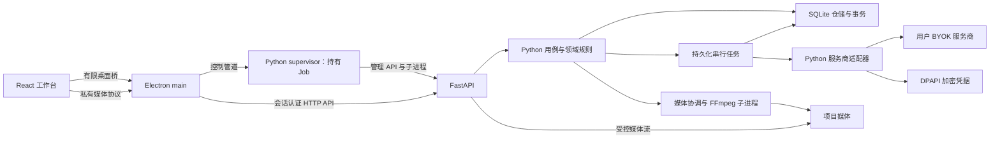

# 技术架构与数据规则

版本 0.7，2026-09-15。本文集中规定实现架构、安全、对象状态及可靠性。当前只有架构基线，没有应用实现。产品边界见[产品定位与功能规格](./01-产品定位与功能规格.md)。

## 1. 技术选择与模块职责

采用前后端分离：前端 Electron + React + TypeScript strict，后端 FastAPI + Python。首版按 Windows 本地产品定位由 Electron 启动 Python 监督进程，再由其管理本机 FastAPI API 进程，通过带会话认证的版本化 HTTP API 通信。后端仅监听 127.0.0.1，采用单 Uvicorn 进程，业务规则、SQLite、模型调用与媒体处理集中在 Python。

前端使用 Vite、普通 CSS 与设计变量、Radix UI；后端使用 Pydantic/OpenAPI、Python sqlite3、持久化单任务执行器及 FFmpeg 子进程。前端 Vitest/Playwright，后端 pytest 与 API/存储集成验证。具体依赖及准确版本在 T01 锁定，先验证双运行时打包、认证通信、协议匹配和生命周期。

| 规划目录 | 职责 |
| --- | --- |
| frontend/electron/main、preload | 窗口、文件选择授权、后端生命周期、受限 IPC/HTTP 与媒体代理 |
| frontend/src | 六组工作台、任务/修改面板、预览与同一时间线的不同视图 |
| backend/app/api/v1 | HTTP 认证、Pydantic 请求响应、项目访问范围与错误映射 |
| backend/app/application、domain | 项目、版本、采用、依赖、预算、检查、时间线及有界任务用例 |
| backend/app/infrastructure/storage | Python sqlite3 仓储、短事务、迁移、锁、备份与媒体索引 |
| backend/app/infrastructure/providers | 经验证的文字、图像、语音、视频、传输和检查适配 |
| backend/app/infrastructure/media、credentials | FFmpeg/ffprobe、媒体作业、DPAPI 与本机配置 |
| backend/app/runtime | supervisor 持有 Windows Job、控制管道与 API 生命周期；API 内持久化任务执行 |
| contracts、两端 tests、fixtures | OpenAPI 产物与类型生成、测试和固定素材；无凭据/签名 URL |

渲染层负责展示、临时输入和操作意图，不读已保存 Key、直接访问供应商或执行命令。Electron main 验证 IPC 来源/参数/文件选择授权，只转发固定 HTTP 操作，不承载业务后端。FastAPI 再验证认证、对象归属与当前状态。

数据库连接按请求/作业管理，不能跨线程共享；短事务不包住网络或编码。HTTP 受理长任务后返回任务 ID，由专用执行器根据数据库状态工作，不能依赖 FastAPI BackgroundTasks 或内存 Future 恢复。媒体进程使用参数数组和 shell=false。首版无微服务、Redis/Celery、向量库或通用智能体运行时。

领域命令仍包括 createProject、openProject、saveDraft、adoptRevision、undoAdoption、planTask、startTask、queryOriginalCall、downloadOriginalResult、replaceTimelineMedia、runChecks、exportFilm，在后端用例中实现并映射到版本化 API。统一返回成功值或 code/message/affectedIds/recoverableAction；通知与状态查询不授权费用。

详细理由、接口与生命周期见[技术选型](./技术方案/01-技术选型.md)和[总体技术架构](./技术方案/02-总体技术架构.md)；T01–T14 设计入口见[模块导航](./技术方案/README.md)，共享字段与迁移归属见[跨模块约定](./技术方案/04-跨模块接口与数据约定.md)。实现仍按模块推进。

## 2. 项目存储与核心对象

项目目录包含 project.sqlite、media/originals、media/derived、exports、staging、backups、logs。凭据和应用设置位于用户应用数据目录，不随项目迁移。媒体导入默认复制，引用使用稳定 UUID 和项目相对路径；同一 Windows 环境移动整个目录后可重开，新设备重新配置 Key。

Python 后端统一管理 SQLite 连接、进程内写入互斥与外键/WAL/synchronous=FULL；只在本机磁盘运行，不直接使用网络共享或存在同步冲突的目录。项目单实例写锁，第二窗口只读。迁移前用 SQLite backup API 备份，不能只复制运行中的主数据库遗漏 WAL。

| 表/对象 | 必要字段与关系 |
| --- | --- |
| projects | id、格式版本、名称、画幅、目标时长、预算币种 |
| artifacts | 稳定对象、类型、当前采用版本、确认版本、草稿；选中状态独立 |
| revisions | artifact_id、parent_id、payload_json、时间；内容版本不可原地改写 |
| media_files | 相对路径、SHA-256、字节数、MIME、探测信息、来源、可用性 |
| dependencies | from/to 具体版本、关系与 semantic_scope；按语义传播 |
| shots | 稳定 id、顺序、时长、台词/资产/帧/视频引用；重排不改 id |
| user_tasks | 有界范围、授权、输入快照、状态 |
| service_calls、call_events | task_id、submission_token、provider/model/region、remote_task_id、状态、请求摘要；事件追加 |
| cost_entries | call_id 唯一、估算/占用/结算、账单依据与状态，整数微元 |
| checks | 被查结果/基准版本、规则类型/版本、证据、问题、用户决定 |
| timeline_clips | 轨、媒体版本、start/in/out 毫秒、音量、字幕/声音关系 |
| rights_evidence | 素材、来源/用途、证据文件、复检状态 |

时间统一整数毫秒，导出按帧率量化；金额定点整数，不浮点累计。预览/导出使用同一时间线，镜头条/多轨只是视图偏好；成本摘要与成本页使用同一计算。

制作依据复用版本 payload 与语义依赖，涵盖原文定位/要求承载、身份/持续状态、人物知情/观众揭示、参考职责/准备、四种时长及对白估计/实测。原文指纹覆盖字节，同长度改字也产生新版本。UI、模板组织和审核读取相同采用版本，不建立另一份可编辑 Markdown 真相。

素材观察作为版本化成果保存媒体版本、观察者/方法、已检查/可用/问题区间及限制。补拍/替代保存原镜版本、承担要求、起止/保持项，新增镜头使用新 ID。字幕正文引用采用台词或独立编辑，定时证据引用音频/视频版本；画内文字政策与揭示关系另记。

## 3. 保存、采用与依赖

媒体落地顺序：写 staging → 核对类型/长度/哈希/可解码性 → 同盘原子改名 → 数据库提交可用记录。崩溃扫描 staging 和未引用文件，修复引用或隔离，不自动删除唯一结果。原件只增不改，派生文件关联输入哈希和参数，低清代理不替代原件。

自动保存当前状态且显示真实时间，失败不覆盖最后可用状态后虚报成功。保留跨重启可恢复的最近一次采用前确认基准及关联，当前会话支持普通文字/时间线撤销；无无限历史/手动快照/云备份，最低恢复记录不替代用户目录备份。

采用新版本在同一事务切换引用、保存采用事件并标记实际相关下游待更新。候选浏览和草稿编辑不传播失效；执行任务时禁止采用改变其输入的上游版本。返回候选绑定提交快照，不自动套用到已变基准。

恢复/撤销采用恢复内容及关联，不删新媒体/原任务/账目。沿用下游必须完成适用检查并再次确认。更换媒体不继承旧观察区间和字幕时间；变更持续状态只影响生效范围；重排影响有关揭示/声音/覆盖，不自动重生成原片。补拍采用以事务更新承载和片段映射，剩余缺口保留。

| 状态域 | 转换与含义 |
| --- | --- |
| 阶段 | 前置不足 → 可开始 → 待审核 → 已确认；采用相关修改后待更新，修复/复检确认后恢复 |
| 用户任务 | 待启动 → 执行中 → 完成/部分完成/结果待确认/结果待下载/确定失败 |
| 未知结果 | 查询可回执行中/完成/确定失败；重启或停止等待不能自行转为失败 |
| 参考准备 | 待准备 → 已导入待核对 → 指定用途可用；缺失/不适配单独显示 |
| 风险 | 已确认阻断、待核实、检查未知、通过；只约束相关内容 |
| 费用 | 提交占用、依据结算、替换占用；不随内容撤销回退 |

## 4. 提交与恢复协议

1. 检查任务范围、实际输入、模型能力、预算和授权上限。
2. 事务生成唯一 submission_token，冻结输入快照、估价与占用，记录 prepared。
3. 串行执行器领取并持久化 submitting，随后仅提交一次请求。
4. 收到远端 ID 立即落盘，再显示生成中；同步回包也先记录再下载。
5. 有限查询原任务，下载/校验/候选登记分开；结果与费用状态独立。

双击通过用户任务标识及唯一约束合并。本地防重不保证供应商 exactly-once。供应商已受理但 ID 返回前断网保持结果待确认，不自动重发；只有官方支持且验证过才使用供应商幂等键。无查询能力提供请求时间、摘要和控制台核查；同步响应丢失同样不承诺找回。

轮询建议 10/15/20/30 秒后保持 30 秒，单次观察最长 10 分钟；到期可继续查询，不标失败。查询失败不触发生成；下载失败恢复原下载，URL 过期先查询原任务，仍失效则说明不可恢复。未知状态阻止尚未提交调用，保留费用占用。

停止等待只停止本地观察。供应商无已验证取消接口不显示云端已取消；原任务日志/费用跨重启。所有恢复按[模型接入与成本控制](./03-模型接入与成本控制.md)的授权与计价规则处理。

## 5. 适配、媒体与导出

适配器接口：describeCapabilities、estimate、prepareInputs、submit、query、download。不支持明确返回缺失，不返回空成功。能力档案包含地域/型号、输入用途/数量/顺序/大小、尺寸/时长档位、音频、单镜条件、价格和有效期。

模板与适配规则版本、采用制作依据、真实参数/媒体进入任务快照；实际传入和仅作审核的条件分开。不丢弃必要参考、不把计划文件当真实输入、不把文字结束状态当尾帧控制。新模板不改历史任务。完整敏感复现资料受项目正文保护，不进普通日志。

生产音频传输先采用用户自有 OSS 或已验证正式替代，签名有效期覆盖排队与生成窗口；运行中不删输入对象，失败/重启保留上传关联，存储成本/权限/删除明确。不得使用未披露第三方公共图床或自有代付。临时研究上传不等于生产可用。

Python 后端通过 ffprobe 读取实际格式、尺寸、时长、帧率、轨道和采样率；媒体进程生成代理、缩略图、波形及区间播放，不能由探测工具判断叙事/口型。领域层检查区间越界、已知必留事件截断、声音/字幕时序和揭示失效，语义遗漏仍需内容审核。

导出固定输出配置与完整采用输入清单，写临时文件，完整解码和时长检查后原子改名。编码前检查磁盘，失败/取消终止本地进程并保留项目/源素材，不重做云端。输出按产品规格，预览与导出共享时序。

FFmpeg 初始采用用户选择本机兼容构建的方式，设置页检查所需编码器与 libass 等字幕条件。研究下载二进制不直接作为获准分发包；若改随包分发，先核验许可证/源码义务、来源、更新机制、体积。软件代码签名、Electron/Python 运行时及依赖/SQLite/FFmpeg 许可与打包兼容在分发前落实。

## 6. 安全、隐私与媒体缺失

Electron 开启 contextIsolation、渲染沙箱，关闭 nodeIntegration；严格 CSP、禁远程脚本和任意内联脚本，限制导航/新窗口。外部 http/https 链接交系统浏览器，不能在应用权限窗口加载远程内容。

IPC 校验 sender、命令结构和文件选择授权；HTTP API 验证每次启动的随机 Bearer、精确 Host/Origin、项目会话与对象归属。令牌由 main 经匿名管道交给后端，不进渲染层、URL、命令行或日志；禁止宽松 CORS 和生产调试接口。后端规范化路径并拒绝越界及不受控符号链接。媒体进程用参数数组，模型输出/文件名不作为命令执行。下载只允许适配器核准 HTTPS，逐跳重定向检查，禁本机/私网/凭据服务，限制大小/类型/超时；响应中 URL 不自动成为新外发目的地。

供应商凭据由 Python 后端通过 Windows 用户范围 DPAPI 加密，确认可用；不可用时拒绝明文保存，可仅本次内存使用。用户录入表单只短暂持有主动输入，提交后清空，不进入全局状态、日志或持久化草稿；已保存 Key 不提供读取回传接口，主工作台只见掩码和配置状态。删除/换 Key 不删账目媒体，不可解密要求重新配置。

日志脱敏 Key、Authorization、凭证、签名 URL、原文与完整声音。诊断包预览外发范围，默认无遥测/云同步，不把全项目上传用于分析或训练。每个任务只向披露的服务发送所需内容。用户素材/音色及内置音频保存许可与补充证据，不能仅靠点击确认就判风险消失。

全部已取得生成素材保留，手工删除后保留结构/费用，定位受影响镜头并允许重新定位核对。当前采用所需媒体缺失阻止导出，无关废弃候选不误拦；不自动付费补图。生成前、下载前和导出前检查空间，已完成但无法保存记待下载和已知期限。

后端随桌面打包，采用保留标准流的 onedir 构建并隐藏窗口，生产无需用户安装 Python。Job 句柄由独立 Python supervisor 持有，API/FFmpeg 加入该 Job，Electron 不直接操作 Job。协议与准确候选基线见 [T01](./技术方案/模块设计/T01-桌面启动安全和导航.md)。退出先持久化再清理本实例后端/媒体进程；重启仅恢复本地事实和原任务查询，不能因 HTTP 断开或进程重启自动重发生成。前后端主版本不兼容时禁止业务操作，项目保留。

## 7. 不变量与验证重点

- 当前选中、当前采用、已确认分别记录；新版本不继承不适用的合格结论。
- 没有自动重生成、自动跨阶段提交和跨镜无人值守队列。
- 一个原调用在账目与完工预测中只计一次；未知费用不为零。
- 恢复不新建生成；内容撤销不删除已发生费用。
- 文件/API 成功不代表内容质量；检查未知不标通过。
- 仅当前采用链影响导出；必要风险不能被普通接受覆盖。
- 应用可靠性测试、模型实测、艺术评审和新手试用各自有证据。

官方参考（已有 2026-09-15 调研）：[Electron 安全](https://www.electronjs.org/docs/latest/tutorial/security)、[SQLite WAL](https://www.sqlite.org/wal.html)、[FFmpeg 许可](https://ffmpeg.org/legal.html)。模型资料见[模型与成本](./03-模型接入与成本控制.md)，任务安排见[开发与验收](./05-开发计划与验收标准.md)。
