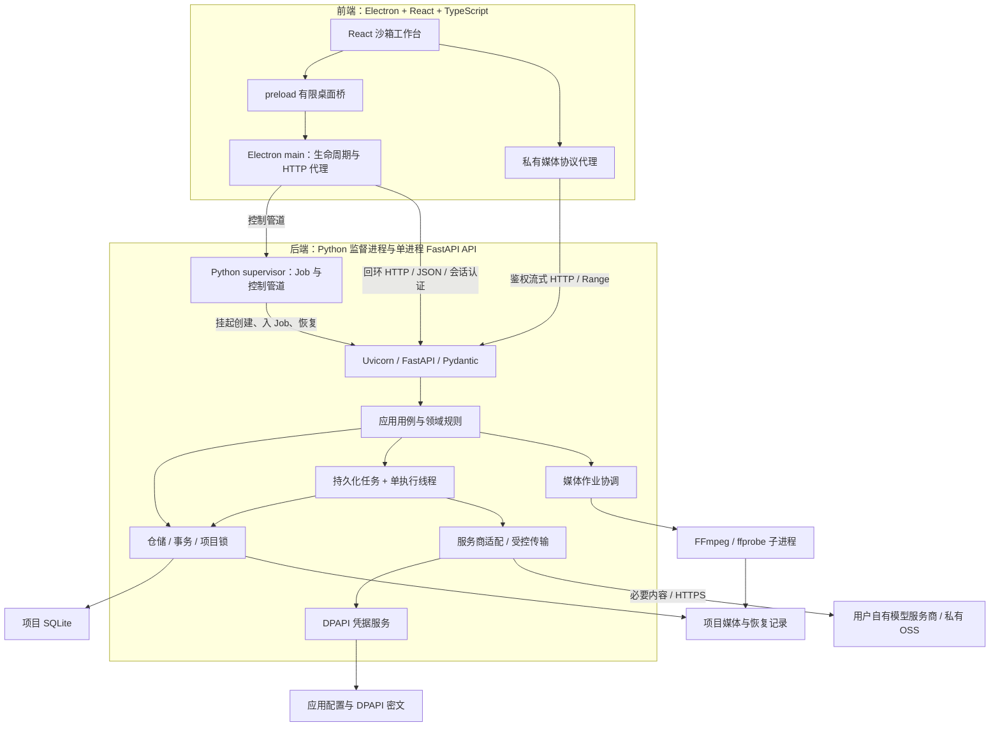
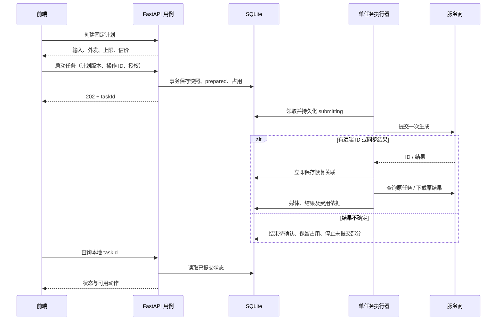

# 总体技术架构

方案版本：0.3，2026-09-15。前端采用 **Electron + React + TypeScript**，后端采用 **FastAPI + Python**。本文细化[技术架构与数据规则](../04-技术架构与数据规则.md)，作为后续逐模块设计的共同边界；尚未实现应用代码。

## 1. 系统形态与职责

前后端通过版本化 HTTP API 分离，独立开发和测试。首版遵循现有 Windows 本地产品定位，由 Electron 管理 Python 监督进程，再由其管理仅监听本机回环地址的 FastAPI API 进程，项目、媒体和配置留在用户设备。后端内部按业务模块组织，一个应用实例只有一个 Uvicorn 进程和一个生成任务执行器。

| 部分 | 负责 | 约束 |
| --- | --- | --- |
| React renderer | 工作台、输入与候选、预览、用户操作、状态展示 | 无 Node、无任意文件/网络权限，不拥有业务持久化事实 |
| Electron preload | 有限且类型明确的桌面桥 | 不暴露通用 IPC、任意 URL 请求或 shell |
| Electron main | 窗口、文件选择授权、后端生命周期、HTTP 与媒体代理 | 不写项目数据库、不计算预算、不执行模型调用 |
| Python supervisor | 控制管道、Windows Job、API 进程与子进程清理 | 无 HTTP、业务数据、模型调用；自身在 Job 外 |
| FastAPI API 层 | 会话认证、请求校验、项目访问范围、DTO 与错误映射 | 快速返回，不在请求中等待完整生成或编码 |
| Python 应用与领域层 | 项目、版本采用、依赖、任务、费用、时间线和检查 | 不依赖 Electron，不以 UI 事件作为账目依据 |
| Python 基础设施 | SQLite、DPAPI、模型客户端、文件、FFmpeg | 只接受用例授权的对象和范围，不绕过业务规则 |

Electron 的 HTTP 代理用于收拢桌面权限和隐藏本机服务令牌，不承担第二套业务后端。FastAPI 可通过受认证 HTTP 客户端独立测试；React 可用同契约的假客户端开发。

## 2. 进程与通信图



线程用于隔离阻塞工作，不是独立安全沙箱。模型调用、磁盘扫描和媒体编码不得阻塞 ASGI 事件循环。短同步仓储用例通过 FastAPI 同步路由线程池执行；生成由专用执行器运行；编码使用独立子进程并由作业协调器跟踪。

## 3. 目标工程结构与依赖方向

以下是目标组织方式，逐模块创建实际需要的目录；T01 不预建所有业务模块。

```text
frontend/
  electron/
    main/                窗口、监督器、命令映射、文件授权、媒体代理
    preload/             有限桌面桥
  src/
    app/                 应用外壳和导航
    features/            各工作台
    components/          共享控件
    api/                 生成类型和类型化客户端
    state/               临时视图状态
  tests/
  package.json
  pnpm-lock.yaml
backend/
  app/
    main.py              FastAPI 工厂、生命周期与装配
    api/v1/              路由、请求响应模型、认证依赖
    application/         项目、采用、生成和导出用例
    domain/              版本、依赖、预算、时间线、检查规则
    infrastructure/
      storage/           sqlite3 仓储、迁移、锁与备份
      providers/         百炼等经验证适配器
      credentials/       DPAPI 与配置
      media/             文件、探测、FFmpeg 作业
    runtime/             启动管道、进程归属、执行器与停止协议
  migrations/            单调递增的版本化 SQL
  tests/
  pyproject.toml
  uv.lock
contracts/
  openapi.json           后端导出的契约产物
fixtures/                固定响应、合成素材及来源说明
docs/
  技术方案/
```

前端只依赖 API 契约和桌面桥。后端方向为 API → application → domain；基础设施实现领域/应用端口，由应用启动处装配。domain 不导入 FastAPI、HTTPX、sqlite3 或媒体命令工具。

后端领域对象使用明确 Python 类型；Pydantic 负责 API 边界和外部结构化响应。返回 DTO 不暴露数据库连接、绝对文件路径、供应商 Key 或完整敏感请求。前端生成类型与后端共享字段定义，业务判断仅在后端实现。

## 4. 后端启动、认证与生命周期

### 4.1 启动顺序

1. Electron 获取单实例锁，生成随机实例 ID 和至少 256 位随机会话令牌。
2. Electron 用固定后端可执行文件的 supervisor role 启动隐藏监督进程；生产资源在 asar 外，console=True 保留标准流，禁止拼 shell。
3. 通过专用匿名管道发送令牌、实例 ID、受控配置目录和协议版本。令牌不进入 argv、环境变量、URL、文件或日志。
4. supervisor 用 pywin32 挂起创建 API、加入其持有的 Job 后恢复，再传递初始化配置；API 实际绑定 `127.0.0.1:0` 并保留 socket 给 Uvicorn，不能释放重绑。
5. API 经监督进程报告 runtimeId、generation、端口和版本。两段管道使用独立序号的有界 UTF-8/LF JSON，stdout 专用于控制帧，stderr 仅脱敏日志。
6. Electron 使用内存令牌请求健康检查，核对实例与协议，成功后开放业务界面。未就绪期间允许导航和说明，不伪造可操作项目。
7. 后续短周期健康观察区分服务未就绪、请求超时、进程退出与协议不兼容。

T01 验证 Uvicorn 绑定 socket、就绪时机和打包行为。服务只监听 IPv4 回环，不监听 `0.0.0.0` 或局域网网卡；生产单 worker、无 reload、无交互调试服务。

### 4.2 API 安全边界

所有业务及健康接口要求当前启动会话的 `Authorization: Bearer`。Electron main 添加该头，renderer 不持有后端端口或令牌，也不直接 fetch 本机后端。

后端校验精确 Host、会话令牌、内容类型、请求大小和项目会话；拒绝浏览器 Origin 请求，不开放宽松 CORS，不使用 cookie 认证。原生 main HTTP 客户端不发送浏览器 Origin。仅依赖“绑定 localhost”或 CORS 不能防止未授权本机请求。

会话令牌与用户供应商 Key 用途不同。供应商 Key 仅供后端调用模型；前端只在用户录入时短暂接触输入，提交后清空，禁止持久化、日志或返回读取接口。

这套机制防止无授权网页和非持有令牌的请求，不承诺抵御同一用户下已取得进程内存权限的恶意程序。首版没有远程认证、多租户或远程开放端口。

### 4.3 停止与重启

正常退出先禁止新任务，后端持久化状态，停止本地观察与编码，关闭数据库连接并释放锁，然后退出。退出不会取消已经被服务商受理的云端任务，不承诺退费。

Python supervisor 在 Job 外持有唯一长寿命、不可继承的 Job Object 句柄，设置 kill-on-close；API 先挂起创建、入 Job 再恢复，FFmpeg 继承归属。main 退出通过专用管道 EOF 触发 supervisor 清理；supervisor 崩溃由系统关闭 Job 句柄；API 崩溃由 supervisor 清理剩余媒体进程。Electron 不直接持有 Job，不增加原生 Node 绑定。不能按名称结束其他程序。

后端崩溃时界面进入断开状态，草稿输入保留，禁止新的提交。用户重启服务会建立新会话并重新读取数据库；只恢复状态和原任务查询，不自动恢复任何可能重复收费的提交。关闭窗口和强制结束各层进程分别测试。完整消息、请求字段、代际竞争、监督进程 7 秒清理窗口和 main 8 秒最终截止，以 [T01 接口与启动协议](./模块设计/T01-接口与启动协议.md) 为准。

## 5. HTTP 契约、错误与状态刷新

统一前缀 `/api/v1`。FastAPI/Pydantic 导出 OpenAPI，存为契约产物，再生成 TypeScript 类型。变更接口时同时更新后端校验、契约、前端调用和契约测试；生成文件不手工修改。

| API 组 | 示例路由与职责 | 模块 |
| --- | --- | --- |
| 运行时 | GET /health，GET /capabilities | T01 |
| 项目 | POST /projects，POST /project-sessions，GET/PATCH /projects/{id} | T02 |
| 配置 | GET /settings，PUT /credentials/{provider}，POST /connection-checks | T03 |
| 任务 | POST /projects/{id}/task-plans，POST /projects/{id}/tasks，GET /projects/{id}/tasks/{taskId} | T04 |
| 原调用恢复 | POST /projects/{id}/calls/{callId}/query，POST /projects/{id}/calls/{callId}/download | T04、T06 |
| 版本采用 | POST /projects/{id}/artifacts/{artifactId}/adoptions，POST /projects/{id}/adoptions/{id}/undo | T05 |
| 内容与制作 | 分镜、参考、声音、时间线的有界接口 | T07–T11 |
| 检查与导出 | POST /projects/{id}/checks，POST /projects/{id}/exports | T12 |
| 媒体 | GET /projects/{id}/media/{mediaId}，POST /projects/{id}/imports | T02，后续扩展 |

除 T01 外，表中路由是资源划分建议；字段、分页和状态转换到所属模块再细化。原任务 query/download 使用 POST 表达恢复操作，但其内部不得提交新的生成。

契约约定：

- 请求使用 requestId 关联诊断；项目操作携带 projectSessionId，写操作携带 expectedRevision。
- 响应返回明确 value 和适用的 committedRevision；错误包含 code、中文 message、affectedIds、recoverableAction 和 requestId。
- 400/422 表示参数问题，401 表示会话无效，403 表示无权限/不合法来源，409 表示版本或状态冲突，503 表示服务/能力当前不可用。
- 长任务接受后返回 202 和 taskId，随后查询状态；任务记录提交成功前不返回已受理。
- 业务防重使用 clientOperationId/userTaskId、submission_token 与数据库唯一约束；requestId 不是供应商幂等保证。
- 列表分页、正文限制大小；完整视频使用流式接口。校验异常和 HTTP 日志不能回显 Key 或完整用户正文。

HTTP 响应丢失时，前端以稳定操作 ID 查询原操作结果，再决定界面状态；不能换一个 ID 重发“生成”。自动重试只用于明确安全的状态读取，费用相关操作按恢复协议处理。

初期前端通过 Electron main 在有活动任务时约每 2 秒查询本地状态，非活动页面停止；这不会触发同频服务商轮询。远端轮询由后端独立按原有 10/15/20/30 秒策略执行。断开重连重新获取快照，事件或轮询响应都不是账目真相。

## 6. 文件授权与媒体路径

用户通过 Electron 原生对话框选择项目目录和导入文件。main 保存短期、绑定窗口和用途的选择授权，只接受授权句柄对应的操作；renderer 不能传任意路径要求读取。main 将已授权路径或流转交后端，后端再次验证本机位置、真实路径、项目范围和符号链接。

后端持有稳定媒体 ID、相对路径和哈希。React 使用私有 `app-media://` 地址显示媒体，Electron 协议处理器将当前项目/媒体 ID 映射为后端受认证请求，令牌不出现在 URL。协议只提供媒体，不返回可执行 HTML、目录列表或任意文件。

媒体代理与后端支持有界 Range、正确 MIME、内容长度、客户端断开取消和流式背压；不把大文件全部读入内存。导入/转码前按工具能力核对媒体类型、体积及解码结果，模型 URL 不能直接用于渲染有权限页面。

## 7. 数据库与事务

每项目目录沿用 `project.sqlite`、`media/originals`、`media/derived`、`staging`、`exports`、`backups`、`logs`。应用配置和 DPAPI 密文独立存放，不随项目复制。

| 对象组 | 主要内容 | 负责模块 |
| --- | --- | --- |
| projects、media_files、迁移历史 | 项目、媒体索引、schema、导入恢复记录 | T02 |
| user_tasks、service_calls、call_events、cost_entries | 授权、快照、提交、远端关联、事件、费用 | T04 |
| artifacts、revisions、dependencies、采用恢复记录 | 稳定对象、不可变版本、当前采用/确认、语义关系 | T05 |
| shots、声音/字幕版本、timeline_clips | 要求承载、镜头顺序、音视频及时间线 | T07–T11 |
| checks、rights_evidence、导出记录 | 检查依据、风险、权利证据、冻结输出清单 | T12 |

实际表结构在模块开始时设计迁移，不在 T01 一次建立所有业务表。任务输入快照 T04 先独立存在，T05 再补完整成果依赖，避免互相等待。

SQLite 连接按请求/作业作用域创建和关闭，不跨线程共享；每个连接开启外键和需要的安全配置。项目使用 WAL、synchronous=FULL、有限 busy_timeout，后端进程内写入互斥、跨进程项目写锁。第二窗口/进程只读时不得偷偷执行迁移、占用或写日志到项目数据库。

关键事务：

1. 创建/保存：元数据、内容与保存版本整体提交；成功后才展示保存时间。
2. 启动调用：授权、输入快照、prepared 调用和占用整体提交；发送网络请求前另行持久化 submitting。
3. 采用：校验 expectedRevision，切换引用、保存恢复基准、标记相关下游待更新整体提交。
4. 结算：以 call_id 唯一关联替换占用，追加校正依据，不与既有占用重复求和。
5. 导出：冻结时间线、采用媒体和检查基准，编码完成后再登记结果。

事务不包含网络、编码、等待用户或长时间计算。基于旧快照计算的改动集在事务内重新校验版本，冲突返回 409 并重新读取。

迁移前通过 sqlite3 的 backup API 生成包含 WAL 状态的一致副本并核验可打开。新 schema 不兼容旧应用时拒绝写入；数据库损坏保留原件，不新建空项目覆盖。共享盘和存在同步冲突的项目目录不作为直接运行位置。

## 8. 媒体保存与崩溃恢复

文件系统与 SQLite 不共享事务，采用可恢复流程：登记导入意图和目标 ID → 写 staging → 核对类型/长度/哈希/解码 → 同盘原子改名 → 事务登记可用媒体。

| 中断点 | 重开后处理 |
| --- | --- |
| 写 staging 中 | 保留部分数据；按原下载能力续取或重新下载原结果 |
| 校验后、改名前 | 复核临时文件，继续同一导入流程 |
| 改名后、登记前 | 根据导入意图、ID 和哈希补登记；不能确认时隔离提示 |
| 已登记文件被外部删除 | 标记缺失，定位受影响镜头，支持重新定位核对 |
| 发现未登记文件 | 不自动删除，先判断可恢复原件或未知来源 |

同盘原子改名不等于断电持久性，T02 还需验证文件刷盘与异常窗口。原件只增不改，低清代理不替代原件；保存失败不虚报成功，也不自动付费补生成。

## 9. 版本、采用和依赖

artifactId 表示稳定业务对象，revisionId 表示不可原地改写的版本。草稿、候选选中、当前采用、已确认分开记录，确认依赖具体版本和有效检查。

依赖边按语义连接具体版本，例如视觉身份、台词声音、字幕定时、时间线位置、要求承载或信息揭示。外套改色仅传播到相关视觉；台词改词传播到声音、字幕、可见对白视频；单改字幕不自动生成配音。

执行器持有输入版本集合，执行中禁止采用会改变其输入的上游版本；无关草稿仍可编辑。返回结果绑定提交快照，不自动套用到新基准，不自动推进下一阶段。

撤销采用恢复最近确认基准及关联，保留已取得媒体、调用和账目。媒体替换不继承旧观察区间/字幕时间；重排保持 ShotId 并重核有关揭示、声音和覆盖；补拍新建 ID，明确承担要求和剩余缺口。

## 10. 可恢复任务与费用



FastAPI BackgroundTasks、内存队列或线程 Future 不是恢复依据。一个专用执行器按数据库状态领取当前用户任务内的有界调用；不建立跨镜无人值守队列。HTTP 客户端和代理都不自动重试生成。

| 状态 | 含义与恢复 |
| --- | --- |
| prepared | 还未进入可能发送窗口；重启显示待启动，明确继续后复核授权与输入 |
| submitting | 可能已发送；无持久化 ID/响应则结果待确认，不再 POST |
| running | 有原 ID，有限查询；超时或停止观察不表示失败 |
| result_unknown | 保留占用、时间和摘要，查询或人工核对 |
| result_pending_download | 仅取回原文件；URL 过期先查询原任务 |
| succeeded / partial / failed | 记录实际结果，失败或未知停止未提交部分，不补跑候选 |

同步响应丢失且无查询能力时不能承诺找回。本地 submission_token 只保证本地防重，供应商幂等键只有官方支持且实测后才启用。

结果和费用状态独立；未知不按零、失败也可能收费。结算替换占用；提交后从未提交估算中移出，同一调用在完工预测中只出现一次。项目、阶段、任务三重余额每次提交前检查；本地查询原结果按既有授权和已披露条件恢复。

未知结果停止原任务后续提交，保留费用占用；用户理解原结果不明和重复费用风险后，才能另行明确启动新任务。该处理不把旧调用改写为失败或零费用，也不能让界面自动转入下一镜。

## 11. 模型、传输与媒体编排

适配器包含 describeCapabilities、estimate、prepareInputs、submit、query、download。能力档案记录准确供应商/地域/型号、输入角色/数量/顺序、互斥模式、尺寸/时长/音频、查询/取消、结果期限及价格来源/日期。

planTask 只做本地编译、已知约束核对与估价。上传在外发范围明确后进行，保存对象和任务关联；生成前复核上传有效期及费用，不把上传或额外 AI 创作隐藏在准备阶段。必要参考不支持时明确阻止，不静默丢图或改模型。

生产传输使用用户自有私有 OSS 或正式核验的替代能力。签名期限覆盖排队与生成，运行/未知时不删输入对象。HTTPX 下载逐跳校验核准 HTTPS、实际连接 IP、大小、类型和超时，禁止本机/私网/凭据服务；返回 URL 不自动获得上传授权。

Python 媒体层执行 ffprobe、FFmpeg，使用受控参数数组和 shell=false。探测、缩略图、波形、代理、混音与编码由专门作业处理；HTTP 返回作业 ID。CPU 密集分析须另用进程，不假定 async 函数能使同步编码无阻塞。

## 12. 时间线、检查与导出

T09 起统一时间线编译成不可变 RenderPlan，包含画布、帧率、媒体哈希、start/in/out、转场、字幕和简单关键帧。预演和正式输出读取同一语义模型，镜头条/多轨只是视图差异。

叙事计划、请求计费、媒体实测、采用区间独立。时间以整数毫秒存储，帧/音频采样按输出规则量化；5 秒素材替换为 3 秒须提示缺口，不自动拉伸、循环或冻结。

导出冻结时间线版本、媒体版本和有效检查基准：核验采用链与必要风险 → 检查磁盘/编码器/媒体 → 编译 → 临时输出 → 完整解码和规格核对 → 原子发布 → 结果登记。覆盖同名输出按产品规则确认，失败保留旧输出和所有源媒体。

导出期间修改草稿不改变正在编码的快照；如当前采用已变，输出明确标识其来源版本。ffprobe 不判断艺术、叙事或口型；未检查区间不标通过，普通接受不能绕过必要阻断。

## 13. 隐私、可观察性与打包

Electron 保持 contextIsolation、sandbox，关闭 nodeIntegration；生产 CSP 禁远程脚本和任意内联脚本，限制导航、新窗口和外部链接。IPC 校验窗口、主 frame、来源、命令、参数和选择授权；后端独立验证认证、项目归属及路径。

后端使用 Windows 用户范围 DPAPI 加密 Key，确认可用才保存；不可用时仅本次内存使用，不能明文降级。删除 Key 不删媒体或账目，密文迁移后无法解密要求重配。项目正文和媒体默认不是整体加密，DPAPI 保护的是凭据。

日志保留 requestId、taskId、callId、状态、耗时和错误码，脱敏 Authorization、Key、签名 URL、原文及完整声音。Uvicorn/HTTPX 异常和 Pydantic 校验错误也需过滤输入。敏感复现资料留在受保护项目记录，诊断包预览范围，默认无遥测和云同步。

生产包包含前端与独立 Python 后端资源，配置/项目位于用户可写目录。T01 验证目录包和双进程退出；T13 完成 Python 依赖、Electron、SQLite、FFmpeg 来源许可、签名、安装与升级。升级前一致备份，协议不兼容时给出修复安装入口，不带旧前端写新 schema。

后续实施顺序见[分模块设计与开发路线](./03-分模块设计与开发路线.md)。前后端分离后，每次仍围绕一个业务模块纵向交付；先完整搭完所有前端页面或所有后端服务，都不能替代模块闭环验收。
