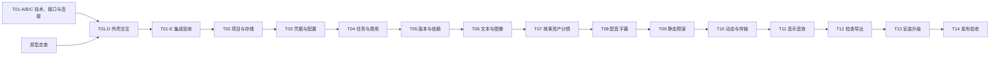

# 分模块设计与开发路线

方案版本：0.3，2026-09-15。前端 Electron + React + TypeScript，后端 FastAPI + Python。沿用[开发计划与验收标准](../05-开发计划与验收标准.md)的 M1–M6、T01–T14，不重新编号。所有应用开发任务仍未完成。

## 1. 推进原则

一次选择一个模块作为当前交付范围，完成“设计 → 前后端实现 → 联调 → 故障验证 → 演示与复盘”，达到该模块验收条件后再进入下一模块。前后端分离不意味着先实现全部前端或全部后端。

当前 T01 保留工程、启动与接口协议；T02–T14 已按本轮用户授权提前补齐需求、接口、数据与示例，见[模块导航](./README.md)。实际代码和生产迁移仍到模块实施时创建，不因设计齐备一次实现全部接口。

每个模块只新增支撑当前交付的基础设施。跨模块契约可以提前定义到能对接的程度，用明确标识的假响应隔离未来依赖；不能把假响应、占位页面或研究脚本计为真实模块完成。

## 2. 前置 G00：可点击原型走查

G00 是交互设计验证，不新增发布里程碑；其相关走查通过是 T01-D 界面定稿的前置，T01-A/B/C 技术工作可先开展。先用预置素材和模拟状态走查以下关键链路：

- 正常：首次配置说明 → 创建项目 → 浏览候选 → 采用 → 下一步。
- 修改：查看当前采用 → 修改草稿 → 影响预览 → 采用/放弃。
- 恢复：后端断开、提交结果未知、下载失败、缺媒体、预算不足各有明确出口。

原型只需覆盖关键交互与状态，不实现完整产品后端，也不调用收费模型。既有原型检查项仍以[制作交互](../02-制作流程与交互设计.md)为准，按上述链路组织，避免把所有工作台一次做成正式页面。

出口证据为可操作原型、走查步骤和观察记录，说明使用者能否理解“当前采用哪版、下一次花多少、停止等待意味着什么”。没有真实使用者的走查只记内部验证，不能替代 T14 新手试用。

技术验证和原型分别推进；不等待完整产品原型才验证进程、接口或打包。已有 [G00 可点击原型与内部走查](../开发准备/G00-原型与走查.md)，真实使用者走查与 T01 应用验证仍待执行。

## 3. 里程碑与开发依赖

图表示默认交付顺序；下表区分实际技术依赖。模型能力专项研究可在原授权下提供输入，但不据此绕过模块验收或自动生成素材。

| 里程碑 | 模块 | 可演示交付 | 进入下一阶段的关口 |
| --- | --- | --- | --- |
| M1 本地安全底座 | T01–T03 | 启动前后端，创建/保存/重开项目，配置能力与加密凭据 | API 隔离、数据恢复、锁和凭据不泄露 |
| M2 可恢复生成 | T04–T06 | 对当前对象启动有预算的文本/图像任务，查看与取回候选 | 双击/断网/重启不重复生成，媒体和费用不丢 |
| M3 故事与静态闭环 | T07–T09 | 从采用内容和素材组成可播放静态预演 | 来源、采用、声音与时长正确；静态预演明确标识 |
| M4 动态与声音 | T10–T11 | 单镜视频/对白、稳定传输、音乐音效和基础混音 | 各真实能力有证据，缺口如实记录 |
| M5 质检与交付 | T12–T13 | 检查当前采用链、输出 MP4、安装与升级 | 导出一致、故障保全、干净 Windows 验证 |
| M6 发布验收 | T14 | 完整模型组合、正式样片、配对质量成本及新手试用 | 原发布质量门槛全部满足 |

T09 的本地静态预演是阶段成果，不表示完整首版。部分云端能力缺失时可验证无关本地能力，相关模块或发布验收不能勾选完成。没有团队规模和实际开发反馈，不承诺日历工期。

## 4. 模块职责与前后端交付

| 模块 | 关键前置 | 前端交付 | 后端交付 | 必须验证的退出条件 |
| --- | --- | --- | --- | --- |
| T01 桌面启动、安全和导航 | 选型与架构；G00 约束 D 批次 | 安全外壳、六组导航、服务状态和恢复入口 | 认证健康/能力 API、生命周期、OpenAPI | 开发/目录包连通；未授权拒绝；退出清理；断开不假成功 |
| T02 项目数据库、媒体和恢复 | T01 | 新建/打开、原文草稿、保存反馈、导入与缺失提示 | 项目 API、SQLite/迁移/锁、媒体索引/导入恢复 | 保存重开、目录移动、第二窗口只读、各文件/事务中断窗口 |
| T03 凭据、能力和完整配置 | T01、T02 | 配置向导、掩码、地域/能力/工具缺口 | DPAPI、能力价格档案、连接检测、工具探测 | 无明文持久化与日志泄露；连接/能力/效果状态分开 |
| T04 任务、费用与未知状态 | T02、T03 | 任务计划/授权、进度/恢复、预算与费用摘要 | 单执行器、输入快照、防重、占用/结算、原调用恢复 | 假服务覆盖提交前后崩溃，未知不重发，结算不双计 |
| T05 版本采用、依赖与撤销 | T02、T04 | 候选/采用/确认、修改影响、撤销 | 不可变版本、语义依赖、采用与恢复事务 | 草稿不改当前片，相关下游失效，费用和媒体不回退 |
| T06 文字、图像与结果取回 | T03–T05 | 当前对象生成和候选浏览、原下载恢复 | 准确文本/图像适配、安全下载、候选/用量登记 | 参数参考真实生效，部分结果保留，不补跑未提交候选 |
| T07 故事、资产与分镜 | T05、T06 | 三入口、角色/场景/道具、镜头卡与实际参考 | 原文承载、持续状态、镜头/参考语义、阶段模板 | 原文不强制改写，ShotId 稳定，参考用途和必留内容可核对 |
| T08 配音、字幕与时间容量 | T04、T05、T07 | 导入/试听、字幕校准、时长缺口 | 音频探测、兼容语音适配、定时与容量校验 | 实测/估计分开；5.2+0.6+0.6 秒不能塞入 6 秒 |
| T09 静态预演与基础时间线 | T07、T08、T02 媒体 | 镜头条/多轨、播放和基础编辑 | 统一时间线、RenderPlan、本地预演/代理 | 七镜 30 秒夹具核对，短素材替换提示，预览/输出共用状态 |
| T10 动态视频、对白与稳定传输 | T04–T09 | 单镜制作、对白路径、原片与相邻对照 | 视频/口型能力、私有传输、原视频取回 | 不藏嘴冒充口型，不省必留动作，运行中输入不误删 |
| T11 音乐、音效与混音 | T08–T10 | 导入或主动生成、裁切、音量和淡入淡出 | 权利记录、兼容 AI 音频适配、混音和音轨去重 | 更换音乐不重做视频，本地素材不冒称 AI 生成完成 |
| T12 检查、修订与正式导出 | T05、T09–T11 | 问题定位/补证/复检、输出与版本说明 | 检查版本、当前采用链、冻结输出、完整解码 | 必要风险阻断正确；失败保留原件；画幅/时长/音轨一致 |
| T13 安装、升级与诊断 | T01–T12 | 安装/升级反馈、诊断预览、配置缺口 | 双运行时打包、迁移回退、签名/许可清单 | 干净 Windows 无 Python 可用，升级和异常退出数据一致 |
| T14 发布验收与组合定级 | T01–T13 及真实能力证据 | 可供真实创作者完成制作的应用 | 完整记录、组合定级和证据汇总 | 六条样片、两名独立评审、五名新手、配对质量成本通过 |

表中简写不减少[原 T01–T14 验收清单](../05-开发计划与验收标准.md)的要求。测试按钮、示例数据和研究结果都要标明性质，不能自动进入真实调用或费用记录。

## 5. 每个模块的设计与开发流程

1. **确认输入与范围**：读取前置交付证据，列出本模块用户动作、正常/失败路径和排除项；如依赖缺失，明确可做的本地部分及不能宣称完成的能力。
2. **写详细设计**：使用[模板](./模块设计/模块设计模板.md)，描述前端、API、领域规则、数据迁移、状态、外发费用、故障处理和验收场景。
3. **核对设计**：对照产品、架构和原开发计划修正冲突，形成可审阅范围；涉及新增费用或产品范围时落实相应授权。
4. **按小批次实现**：先用固定夹具建立最小前后端闭环，再增加异常恢复；每个批次能够运行、演示和回退。
5. **联调与验证**：运行当前模块有价值的单元、API/存储集成、契约及必要桌面 E2E；真实模型测试单列，遵守当次费用授权。
6. **记录交付**：留下准确版本、执行命令、结果、故障证据和已知限制，回写原开发计划实际通过的复选框。
7. **进入下一模块**：交付当前成果和剩余问题，不随手扩展下一模块的业务；下一模块先补设计。

数据库迁移、重复收费、凭据、权限和媒体丢失属于必须具备故障验证的行为。纯文档和低影响样式变更不为凑覆盖率新增机械测试。验证结果不能只写“应该能用”，需有执行环境与观察。

## 6. 完成与暂停条件

一个模块可标记完成，需要同时满足：范围内功能真实实现、两端契约一致、原验收清单和模块新增约束通过、关键故障可解释恢复、交付证据可复查。只完成接口或页面的一侧记部分完成。

以下情况暂停该模块的后续提交或扩大范围：接口来源/认证未通过、迁移可能损坏数据、防重或费用占用不成立、必要模型能力缺失、没有授权的真实调用。暂停的是受影响操作；可以继续做不依赖该问题的文档、本地设计或验证，但不能降低验收标准。

## 7. 本轮产物与下一步

本轮交付 T01–T14 设计、业务契约、SQL、验证示例和 G00 原型，未创建应用工程或调用模型。资料验证见[开发准入结果](../开发准备/资料验证结果.md)。下一步按 [T01 详细方案](./模块设计/T01-桌面启动安全和导航.md)从 A 批次开始，在 D 批次前完成 G00 相关使用者走查。

T01 结束后按 T02 已有基线实施“项目可创建、保存、重开与故障恢复”，复核实际迁移和接口；不提前实现故事生成、时间线或视频生产。后续均按同一节奏推进。
