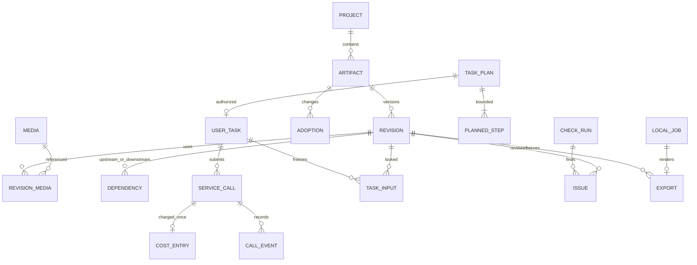

# 数据模型与迁移归属

设计基线 0.1.0。[项目 SQL](./project.sql)和[应用 SQL](./application.sql)可在空的内存数据库执行；它们是最终关系设计，不是生产直接执行的迁移。JSON 结构以[领域 Schema](../契约/domain.schema.json)为准。

PROJECT 是单数据库作用域，多数表不重复 project_id；HTTP 必须先绑定项目会话，再按该库查 ID。不存在项目库之间的外键。

| 首次迁移 | 数据表 | 主要不变量 |
| --- | --- | --- |
| 002 | projects、operations、drafts、media_files、import_intents、local_jobs | 单项目、操作 ID 防重、媒体相对路径、一个重媒体作业 |
| 003 | 项目 stage_models；应用 settings/credentials/capabilities/storage_profiles/recent_projects/global_operations/global_jobs | 分阶段模型、配置 CAS、秘密隔离；stage_models 不引用未来预算表 |
| 004 | stage_budgets、task_plans、planned_steps、user_tasks、service_calls、call_events、cost_entries、external_expenses、uploads | 单任务、单提交 token、计划 step 归属、调用费用唯一、事件追加 |
| 005 | artifacts、revisions、revision_media、dependencies、task_inputs、adoptions | 版本不可变、采用/确认同对象、引用存在、撤销快照 |
| 007 | shots | 稳定镜头 ID、序号唯一、补拍与原镜关系 |
| 009 | timeline_indexes | 时间线版本索引、媒体/内容引用、正时长 |
| 012 | check_runs、checks、check_decisions、rights_evidence、exports | 检查执行与问题分离、阻断不可普通接受、导出完成需媒体 |

T02 创建项目涉及应用级 global_operations，因此应用库的最小 operations/recent_projects/jobs 基础在 T02 建立，003 增加配置/凭据/能力；不等 T03 才支持创建恢复。后续迁移必须考虑 SQLite 增外键需重建表的情况，先一致备份，迁移与 schema 更新同事务。

检查以下约束由三层分工：SQL 保证外键/唯一/正数/不可变；Schema 保证类型/枚举/字段/内容形状；用例保证语义依赖无环、预算分配、phase 与 Stage 匹配、媒体长度、当前采用归属、真实检查覆盖、权限/路径实际解析和恢复状态。SQL 测试通过不能表示所有用例规则已实现。

adoptions.before_snapshot_json 按 AdoptionSnapshot 校验；local_jobs 的媒体作业快照采用 RenderPlan 或对应导入/诊断命令快照，不能临时读取 renderer 当前状态。完整清单含媒体哈希/来源，旧任务不因当前模板变化而重写。

时间为整数毫秒，金额整数微元，主键为 UUIDv4。完整 schema/单位定义和 CAS 细则见[跨模块约定](../04-跨模块接口与数据约定.md)。SQLite STRICT 要求 3.37+，设计验证使用当前 Python 携带 SQLite，生产版本在 T01 运行时基线中另验。
